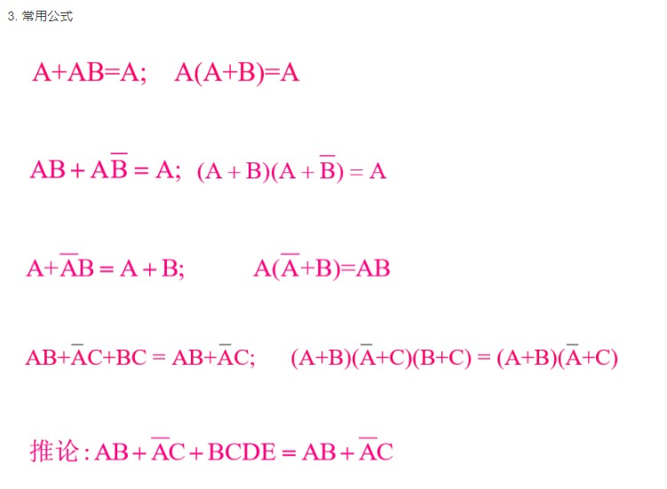

+++
author = "coucou"
title = "硬件——数字逻辑"
date = "2022-08-01"
description = "硬件专题之数字逻辑"
categories = [
    "硬件"
]
tags = [
    "硬件","数字逻辑"
]
+++

# 数字逻辑

## 绪论

>1.信号是传载信息的函数，信号常分为模拟信号、连续时间信号、离散时间信号和数字信号。
>
>2.电子电路中的信号一般分为两类：模拟信号和数字信号。处理模拟信号的电路，称为模拟电路。处理数字信号的电路，称为数字电路。
>
>3.模拟信号经过抽样、量化、编码后得到数字信号。

## 第一章 数字逻辑基础

- 二进制、八进制、十进制和十六进制之间的转换

- 8421BCD码与十进制之间的转换

  

- 十进制与原码、反码、补码之间的转换

  

## 第二章 逻辑门电路

> 逻辑门电路，与或非，异或，同或

## 第三章 逻辑代数

* 卡诺图化简

## 第四章 组合逻辑电路

>1）电路任意时刻的输出状态，只取决于该时刻的输入状态，而与该时刻之前的电路输入和输出状态`无关`
>2）`不具备`存储功能的电路
>3）从输出到输入`无`反馈连接

## 第五章 触发器

* RS触发器
* D触发器
* JK触发器
* T触发器

## 第六章 时序逻辑电路

>1）电路任意时刻的输出状态，与该时刻的输入状态有关，与该时刻之前的电路输入和输出状态也`有关`
>2）`具备`存储功能的电路
>3）从输出到输入`存在`反馈连接

* 同步时序电路分析与设计

## 第七章 脉冲波形的产生与变换

* 555定时器
* 施密特触发器

## 其他

>1、二极管
>
>共阴极半导体数码管公共端为`低电平`，共阳极数码管公共端为`高电平`；因为共阴极数码管公共端为低电平，所以输入信号为1有效，对应的二极管亮
>
>2、触发器
>
>D触发器：特性方程：Q* = D
>RS触发器：特性方程：Q* =S+R’ Q , RS=0为约束条件
>JK触发器：特性方程：Q* = JQ’ + K’ Q
>T触发器: 特性方程：Q* = TQ’ + T’ Q
>
>3、三态门
>
>三态门的输出有三种状态：高电平、低电平、`高阻状态`
>
>
